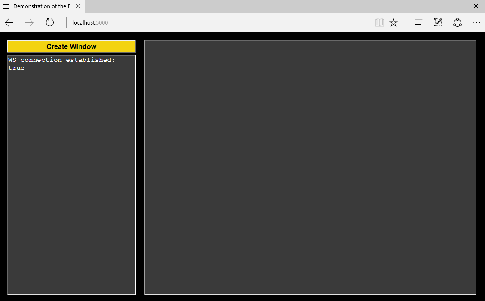
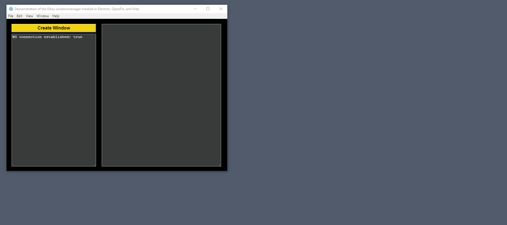
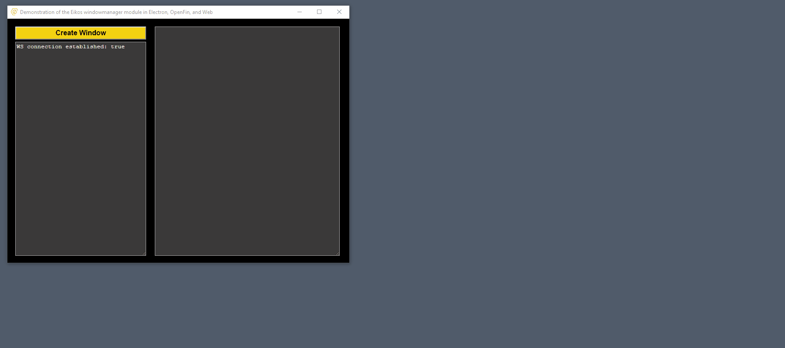

## Demonstration of windowmanager module in Web, Electron and OpenFin 

This is a simple demonstration of the windowmanagerjs module that shows the ability to create draggable windows inside an HTML page regardless of runtime.  A single codeset was written that generates interactive windows in any modern browser OR in native desktop applications contained in the Chromium-based OpenFin and Electron runtimes.  

The windowmanagerjs repository referenced by this project can be found here:

<a target="_blank" href="https://github.com/EikosPartners/windowmanagerjs">Eikos Partners windowmanager on GitHub</a>

<a target="_blank" href="https://eikospartners.github.io/windowmanagerjs/index.html">Eikos Partners windowmanager Documentation</a>

A production-quality implementation of windowmanagerjs complied for all three runtimes and for Windows, macOS, and Linux can be found here:

<a target="_blank" href="http://blotter.eikospartners.com/install">Eikos Partners Blotter Demonstration</a>

Below is a breakdown of how to execute this project by runtime.

<h2>Server</h2>

The backend of the is project is provided via node.js.  It uses standard npm packages to standup an HTTP and WebSocket server that powers the client interfaces and messaging.  After cloning the repository perform an package install:

      npm install

To start the server, simply press F5 in Visual Studio Code or run command line:

      npm start

The server provides all of the HTML and JavaScript content the application will consume.  Also, the server provides an installation page which can be reached at <a href="http://localhost:5000/install" target="_blank">http://localhost:5000/install</a> for any of the three runtimes.  Or the runtimes can be invoked via command line as explained in the follow sections.  

<h2>Web Browser</h2>
  
Windowmanagerjs supports all modern browsers including Chrome, Firefox, IE, Edge, and Safari.  With the node server running, view the application in a browser through the URL <a href="http://localhost:5000/" target="_blank">http://localhost:5000/</a>.

<h2>Electron</h2>

Electron is a very popular open-source runtime based on Google's Chromium project that allows for native desktop applications in Windows, macOS, and Linux.  

With the node server running, start the application in Electron with following command line in the root folder:

      npm run electron

Also, to compile an installation package for the current operating system run the command:

      npm run electron-build

More information about the Electron runtime <a href="http://electron.atom.io/" target="_blank">http://electron.atom.io/</a>.

<h2>OpenFin</h2>

OpenFin is also a Chromium container based on Electron that allows native desktop applications in Windows, macOS and Linux.  It provides several additions to including subscription based support with guaranteed response times, enterprise version management, and cross-language APIs (.Net, Java, etc.).  

With the node server running, start the application in OpenFin with following command line in the root folder:

      npm run openfin

More information about the OpenFin runtime and the company can be found at <a href="https://openfin.co/" target="_blank">https://openfin.co/</a>.